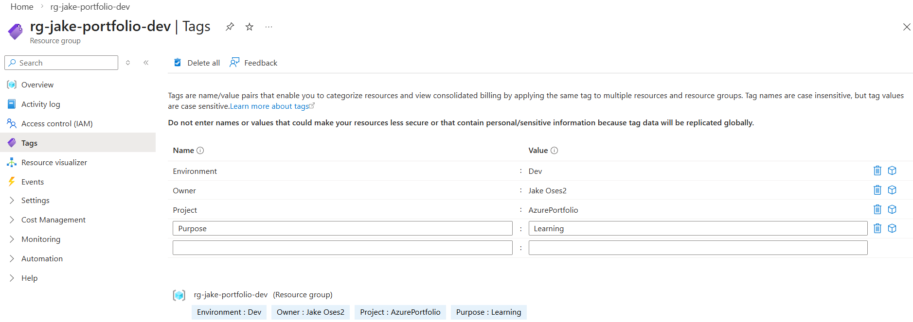
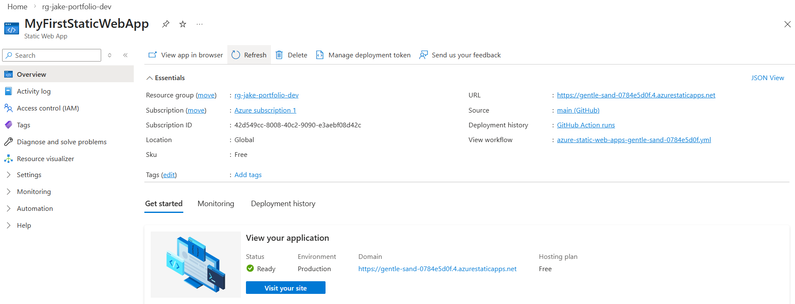
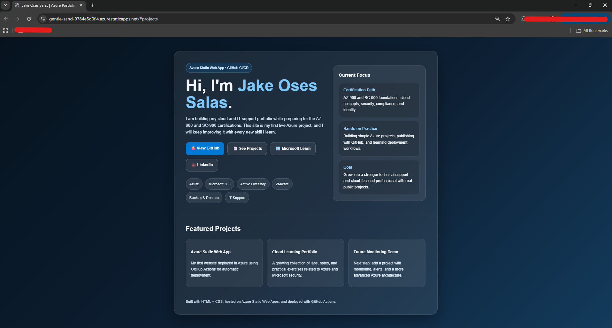

# Azure Portfolio Lab - Secure Web App with Monitoring

## Objective
Deploy a simple Azure-hosted web application using Infrastructure as Code, apply basic RBAC concepts, and configure monitoring alerts.

## Architecture
- Resource Group
- App Service Plan
- Web App
- Storage Account
- Azure Monitor Alert

## Technologies
- Azure Portal
- Azure CLI
- Bicep
- Azure Monitor
- Azure RBAC

## Deployment Steps
1. I have created a resource group named "rg-jake-portfolio-dev" to deploy and implement new resources to my simulated cloud environment, configured tags and naming for future and possible automation processes

2. Deployed a Static Web Application which shows an overview of my project as well as functional options that redirect to my social media and important links

3. Create metric alert
4. Validate deployment

## Security
- Access scoped at Resource Group level
- Reader role for review-only access
- Principle of least privilege applied

## Cost Estimate
Estimated monthly cost using Azure pricing calculator: $X

## Evidence
Screenshots available in `/screenshots`

## Lessons Learned
- Importance of naming standards
- Value of IaC for repeatability
- Benefits of monitoring and alerts
